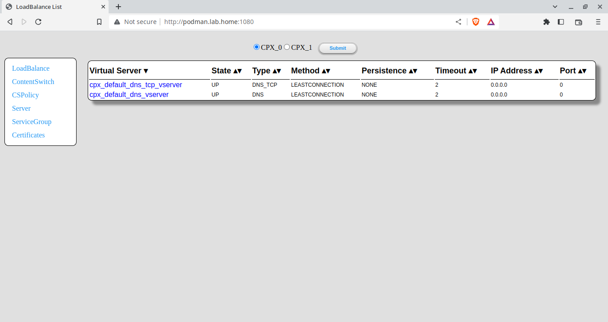

# php_adcread

## Description

PHP script to provide a NetScaler ADC read only interface. It supports multiple instances of Citrix Netscaler ADC.

## Screenshots




## Usage

0. The default configuration in html/config.php is based on the NetScaler ADC CPX docker image example in part 4 below.

    ```
    $username='phpread';
    $password='Passw0rd';

    $netscaler["0"]['URL'] = "https://podman.lab.home:9443/nitro/v1";
    $netscaler["1"]['URL'] = "https://podman.lab.home:8443/nitro/v1";
    $netscaler["0"]['label'] = "CPX_0";
    $netscaler["1"]['label'] = "CPX_1";
    ```

1. Simply copy the index.php to an existing PHP capable web server. It requires the ***php-session*** package.

    ```
    cd /var/www/html
    git clone https://github.com/naebrae/php_adcread.git adcread
    cd adcread
    vi html/config.php
    ```
    ```
    curl http://localhost/adcread/html
    ```

2. Docker or Podman

    > Note: this example doesn't release the terminal. Add -dt to the run command to detach the terminal and run in the background.
    > This maps the local folder in to the docker container so that the file can be edited with out having to rebuild or restart the container.

    ```
    git clone https://github.com/naebrae/php_adcread.git adcread
    cd adcread
    vi html/config.php
    podman build -t adcread .
    podman run -p 1080:80 -p 1443:443 -v ./html/:/var/www/html localhost/adcread
    ```
    ```
    curl http://localhost:1080
    ```

3. Docker-compose

    > Note: this example doesn't release the terminal. Add -d to the up command to detach the terminal and run in the background.
    > This maps the local folder in to the docker container so that the file can be edited with out having to rebuild or restart the container.

    ```
    git clone https://github.com/naebrae/php_adcread.git adcread
    cd adcread
    vi html/config.php
    sudo docker-compose build
    sudo docker-compose up
    ```
    ```
    curl http://localhost:1080
    ```

4. Testing with the NetScaler CPX docker image.

    The latest image is available at https://quay.io/repository/citrix/citrix-k8s-cpx-ingress?tab=tags

    To start the image run the following. Replace podman with docker if applicable.

    ```
    sudo podman run -dt -p 9443:9443 --name CPX_0 --privileged=true -e EULA=yes quay.io/citrix/citrix-k8s-cpx-ingress:13.1-48.47
    ```

    The example configuration uses a second CPX instance. Start that with the following.

    ```
    sudo podman run -dt -p 8443:9443 --name CPX_1 --privileged=true -e EULA=yes quay.io/citrix/citrix-k8s-cpx-ingress:13.1-48.47
    ```

    To create a read only user, connect to the container and run the following cli_script.sh commands.

    ```
    sudo podman exec -it CPX_0 bash

    cli_script.sh "add system user phpread Passw0rd -externalAuth DISABLED -timeout 900 -maxsession 20 -allowedManagementInterface API"
    cli_script.sh "bind system user phpread read-only 0"
    ```

    This does not affect the adcread script but the image used above has a problem when connecting to the web interface on https://podman.lab.home:9443 where is complains that the nstmp folder has the wrong permissions. That can be fixed by connecting to the container and running:

    ```
    chmod 777 /var/nstmp
    ```

    While connected to the container, retrieve the ***nsroot*** password with:

    ```
    cat /var/deviceinfo/random_id; echo ""
    ```

    You can now connect to the CPX instance on your docker/podman machine on port 9443 ( eg https://podman.lab.home:9443 ), or 8443 for the second CPX instance, to login to the CPX instances using the nsroot account with the random password generated.

    When finished with the container and it is no longer needed, stop and remove it.

    ```
    sudo podman stop CPX_0
    sudo podman rm CPX_0
    ```
